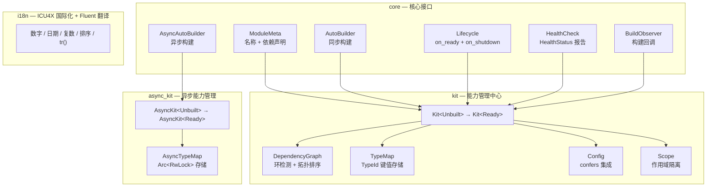

<div align="center">

<p align="center">
  
</p>

[![CI][ci-badge]][ci-url] [![crates.io][crates-badge]][crates-url] [![docs.rs][docs-badge]][docs-url] [![downloads][downloads-badge]][downloads-url] [![MIT licensed][license-badge]][license-url] [![MSRV][msrv-badge]][msrv-url]

中文 | [English](./README_EN.md)

</div>

**trait-kit** 是一个轻量级 Rust 库，提供标准化的模块接口和集中式能力与配置管理中心（`Kit`）。采用 typestate 模式（`Kit<Unbuilt>` → `Kit<Ready>`）进行构建时验证，基于 `RefCell` 的内部可变性实现单线程设计（`!Sync`）。

---

## ✨ 核心特性

- **标准化模块接口** — `ModuleMeta` + `AutoBuilder` trait 定义统一契约，配合 `impl_module_meta!` / `impl_auto_builder!` 宏可一行声明模块。
- **Typestate 构建验证** — `Kit<Unbuilt>` 注册模块和配置；`kit.build()` 验证依赖图（环检测、缺失依赖检测）并返回 `Kit<Ready>`，构建错误在应用启动前暴露。
- **类型安全的能力检索** — 能力按模块类型存储和检索（`kit.require::<LoggerModule>()`），而非字符串键。无需 downcast，无需运行时查找。
- **配置中心** — `kit.set_config(value)` / `kit.config::<C>()` 通过 `TypeMap`（以 `TypeId` 为键）存储和检索类型化配置，无需 `ConfigKey` 或 `ConfigHandle` 样板代码。
- **可选 confers 集成** — 四级 feature flag 集成 [`confers`](https://crates.io/crates/confers)，支持 derive 宏配置加载、热重载订阅和 XChaCha20-Poly1305 加密配置存储。
- **`AsyncKit` 异步支持** — `async` feature 提供 `AsyncKit`，支持 `Send + Sync` 的异步能力管理，适用于数据库连接池、HTTP 客户端等异步初始化场景。
- **ICU4X 国际化** — 内置 ICU4X 支持，提供区域感知的数字、日期、复数和排序能力，以及基于 Fluent FTL 的中英文消息翻译（`tr()`）。
- **最小依赖** — 仅 `thiserror`、`icu`、`writeable`、`sys-locale` 为必需依赖。`confers`、`serde`、`serde_json` 均为可选，仅在启用对应 feature 时引入。
- **`#![deny(unsafe_code)]`** — 整个 crate 无任何 `unsafe` 代码。

---

## 📦 快速开始

### MSRV

最低支持 Rust 版本：**1.91**

### 安装

```sh
cargo add trait-kit
```

### 基础使用

定义一个 logger 模块，注册、构建 Kit，然后检索能力：

```rust
use std::sync::Arc;
use trait_kit::impl_module_meta;
use trait_kit::prelude::*;

// 1. 定义能力（任意 Clone 类型）
struct StdoutLogger;
impl StdoutLogger {
    fn info(&self, msg: &str) {
        println!("[LOG] {msg}");
    }
}

// 2. 定义模块（宏一行声明 ModuleMeta）
struct LoggerModule;
impl_module_meta!(LoggerModule, "logger");
impl AutoBuilder for LoggerModule {
    type Capability = Arc<StdoutLogger>;
    type Error = TraitKitError;
    fn build(_kit: &Kit) -> Result<Self::Capability, Self::Error> {
        Ok(Arc::new(StdoutLogger))
    }
}

// 3. 注册、构建、使用
fn main() {
    let mut kit = Kit::new();
    kit.register::<LoggerModule>().unwrap();
    let kit = kit.build().unwrap();

    let logger = kit.require::<LoggerModule>().unwrap();
    logger.info("Hello from trait-kit!");
    assert!(kit.contains::<LoggerModule>());
}
```

---

## 🔧 用法

### 带配置的模块

配置是存储在 Kit 的 `TypeMap` 中的类型化值。模块在构建时通过 `kit.config::<C>()` 检索：

```rust
use std::sync::Arc;
use trait_kit::impl_module_meta;
use trait_kit::prelude::*;

#[derive(Clone, Debug)]
struct DbConfig {
    url: String,
    max_connections: u32,
}

struct DbPool {
    config: DbConfig,
}

struct DbPoolModule;
impl_module_meta!(DbPoolModule, "db-pool");
impl AutoBuilder for DbPoolModule {
    type Capability = Arc<DbPool>;
    type Error = TraitKitError;
    fn build(kit: &Kit) -> Result<Self::Capability, Self::Error> {
        let config: DbConfig = kit.config()?;
        Ok(Arc::new(DbPool { config }))
    }
}

fn main() {
    let mut kit = Kit::new();
    kit.set_config(DbConfig {
        url: "postgres://localhost".into(),
        max_connections: 10,
    });
    kit.register::<DbPoolModule>().unwrap();
    let kit = kit.build().unwrap();

    let pool = kit.require::<DbPoolModule>().unwrap();
    assert_eq!(pool.config.max_connections, 10);
}
```

### 带依赖的模块

模块通过 `impl_module_meta!` 宏声明依赖。Kit 在构建时验证依赖图，并按拓扑顺序构造模块：

```rust
use std::sync::Arc;
use trait_kit::impl_module_meta;
use trait_kit::prelude::*;

struct Logger;
impl Logger {
    fn info(&self, msg: &str) { println!("[LOG] {msg}"); }
}

struct LoggerModule;
impl_module_meta!(LoggerModule, "logger");
impl AutoBuilder for LoggerModule {
    type Capability = Arc<Logger>;
    type Error = TraitKitError;
    fn build(_kit: &Kit) -> Result<Self::Capability, Self::Error> {
        Ok(Arc::new(Logger))
    }
}

struct Storage {
    _logger: Arc<Logger>,
}

struct StorageModule;
impl_module_meta!(StorageModule, "storage", deps = [LoggerModule]);
impl AutoBuilder for StorageModule {
    type Capability = Arc<Storage>;
    type Error = TraitKitError;
    fn build(kit: &Kit) -> Result<Self::Capability, Self::Error> {
        let logger = kit.require::<LoggerModule>()?;
        Ok(Arc::new(Storage { _logger: logger }))
    }
}

fn main() {
    let mut kit = Kit::new();
    kit.register::<LoggerModule>().unwrap();
    kit.register::<StorageModule>().unwrap();
    let kit = kit.build().unwrap();

    let storage = kit.require::<StorageModule>().unwrap();
    let _ = storage;
}
```

### Kit API 总览

| 方法                                  | 可用阶段        | 说明                                                   |
| ------------------------------------- | --------------- | ------------------------------------------------------ |
| `Kit::new()`                          | —               | 创建空的 `Kit<Unbuilt>`。                              |
| `kit.register::<M>()`                | `Kit<Unbuilt>`  | 注册模块以进行构建。                                   |
| `kit.register_lazy::<M>()`           | `Kit<Unbuilt>`  | 注册延迟构建（首次 `require()` 时构造）。              |
| `kit.register_multi::<M>()`          | `Kit<Unbuilt>`  | 注册多绑定（相同能力类型）。                           |
| `kit.register_as::<M>()`             | `Kit<Unbuilt>`  | 按接口类型注册（`dyn Trait`）。                         |
| `kit.register_if::<M>()`             | `Kit<Unbuilt>`  | 条件注册（运行时谓词控制）。                           |
| `kit.register_lifecycle::<M>()`      | `Kit<Unbuilt>`  | 注册模块的生命周期钩子。                               |
| `kit.register_health_check::<M>()`   | `Kit<Unbuilt>`  | 注册模块的健康检查。                                   |
| `kit.with_observer(obs)`             | `Kit<Unbuilt>`  | 附加 `BuildObserver` 构建回调。                         |
| `kit.decorate::<M>(f)`               | `Kit<Unbuilt>`  | 构建后能力包装/增强。                                  |
| `kit.set_config::<C>(value)`         | 两者皆可        | 存储类型化配置值。                                     |
| `kit.config::<C>()`                  | 两者皆可        | 检索配置值（克隆）。                                   |
| `kit.build()`                         | `Kit<Unbuilt>`  | 验证依赖图并构建所有模块 → `Kit<Ready>`。               |
| `kit.require::<M>()`                 | `Kit<Ready>`    | 检索能力（缺失时报错）。                               |
| `kit.require_ref::<M>()`             | `Kit<Ready>`    | 零拷贝能力检索（`Ref<'_, Cap>`）。                      |
| `kit.optional::<M>()`                | `Kit<Ready>`    | 检索能力（缺失时返回 `None`）。                        |
| `kit.require_all::<M>()`             | `Kit<Ready>`    | 返回所有多绑定能力。                                   |
| `kit.resolve::<I>()`                 | `Kit<Ready>`    | 按接口类型检索（`Arc<I>`）。                            |
| `kit.contains::<M>()`                | `Kit<Ready>`    | 检查能力是否已构建。                                   |
| `kit.contains_config::<C>()`         | `Kit<Ready>`    | 检查配置值是否存在。                                   |
| `kit.health_check::<M>()`            | `Kit<Ready>`    | 运行模块健康检查。                                     |
| `kit.shutdown()`                     | `Kit<Ready>`    | 按拓扑逆序运行 `on_shutdown`。                          |

---

## 🏷️ 特性标志

| Feature | 启用 | 说明 |
| --- | --- | --- |
| `default` | — | 无额外特性，仅核心 `Module` + `Kit`。 |
| `async` | — | `AsyncKit`：`Send + Sync` 异步能力管理，无需额外依赖。 |
| `confers` | `dep:confers`, `dep:serde` | `Configurable` trait + `Kit::load_config`。 |
| `confers-macros` | `confers` | `ModuleConfig` trait + `Config` derive 宏再导出。 |
| `hot-reload` | `confers-macros`, `confers/watch` | `subscribe` / `reload_config` 热重载 API。 |
| `encryption` | `hot-reload`, `confers/encryption`, `dep:serde_json` | `set_encrypted` / `get_encrypted` 加密配置存储。 |
| `interface` | — | 接口/实现分离：`register_as` / `resolve` 支持 `dyn Trait` 类型擦除注册与检索。 |
| `lifecycle` | — | 生命周期钩子：`on_ready`（构建后）+ `on_shutdown`（清理）。 |
| `health` | — | 健康检查：`HealthCheck` trait + `HealthStatus` 状态报告。 |
| `scope` | — | 作用域依赖：`Scope` 每请求实例隔离。 |
| `conditional` | — | 条件注册：运行时谓词控制的模块注册。 |
| `observability` | — | 构建可观测：`BuildObserver` 回调（开始/完成/错误）。 |
| `factory` | — | 工厂模式：每次调用创建新实例（非单例）。 |
| `decorator` | — | 模块装饰器：构建后能力包装/增强。 |

在 `Cargo.toml` 中启用所需级别：

```toml
[dependencies]
trait-kit = { version = "0.4", features = ["encryption"] }
```

---

## ⚙️ 配置：confers 集成

trait-kit 通过四级 feature flag 集成 [`confers`](https://crates.io/crates/confers) 0.4。每个级别继承前一级别，形成分层能力系统。

### confers 特性标志

| Feature               | 启用                                            | 说明                                           |
| --------------------- | ----------------------------------------------- | ---------------------------------------------- |
| `confers`             | `dep:confers`, `dep:serde`                      | `Configurable` trait + `Kit::load_config`。     |
| `confers-macros`      | `confers`                                       | `ModuleConfig` trait + `Config` derive 宏再导出。|
| `hot-reload`  | `confers-macros`, `confers/watch`               | `subscribe` / `reload_config` API。             |
| `encryption`  | `hot-reload`, `confers/encryption`, `dep:serde_json` | `set_encrypted` / `get_encrypted` API。  |

### 三级继承体系

1. **模块能力继承**（第一层）：`ModuleConfig` trait 声明 `PATH` 和 `default_value()`，将配置类型绑定到模块的配置路径。

2. **Cargo feature 继承**（第二层）：每个 feature 级别继承前一级别（`encryption` → `hot-reload` → `confers-macros` → `confers`）。启用高级别会自动启用所有低级别。

3. **配置值继承**（第三层）：加密密钥通过 HKDF 从 `ModuleConfig::PATH` 派生，因此同一主密钥可为不同模块生成不同的字段密钥。

### 第一级：配置加载模式

定义 `Configurable` 实现，桥接 confers 的 `#[derive(Config)]` 宏：

```rust,ignore
use trait_kit::prelude::*;
use trait_kit::kit::Config;

#[derive(Debug, Clone, PartialEq, serde::Deserialize, Config)]
#[config(env_prefix = "APP_")]
struct AppConfig {
    #[config(default = "localhost".to_string())]
    host: String,
}

impl Configurable for AppConfig {
    fn load() -> Result<Self, Box<dyn std::error::Error>> {
        Ok(AppConfig::load_sync()?)
    }
}

let kit = Kit::new();
kit.load_config::<AppConfig>()?;  // 通过 confers 从环境变量/默认值加载
let kit = kit.build()?;
let config: AppConfig = kit.config()?;
```

### 第二级：模块配置元数据

添加 `ModuleConfig` 以声明配置路径和默认值：

```rust,ignore
use trait_kit::kit::config::ModuleConfig;

impl ModuleConfig for AppConfig {
    const PATH: &'static str = "config/app.toml";
    fn default_value() -> Self {
        Self { host: "localhost".to_string() }
    }
}
```

### 第三级：热重载订阅

订阅配置重载时触发的回调：

```rust,ignore
use std::cell::Cell;
use std::rc::Rc;

let kit = Kit::new();
let called = Rc::new(Cell::new(false));
let called_clone = Rc::clone(&called);
kit.subscribe::<AppConfig>(move || {
    called_clone.set(true);
});

kit.reload_config::<AppConfig>()?;  // 通过 Configurable::load 重载，通知订阅者
assert!(called.get());
```

### 第四级：加密配置存储

使用 XChaCha20-Poly1305 加密静态配置。加密密钥通过 HKDF 从主密钥和 `ModuleConfig::PATH` 派生：

```rust,ignore
let kit = Kit::new();
let secret = AppConfig { host: "production-db".to_string() };
let master_key = [0u8; 32]; // 32 字节主密钥

kit.set_encrypted(&secret, &master_key)?;
let kit = kit.build()?;

// 只有正确的主密钥才能解密
let decrypted: AppConfig = kit.get_encrypted(&master_key)?;
assert_eq!(decrypted, secret);
```

---

## 🏗️ 架构



**核心设计**：

- **Typestate 模式**：`Kit<Unbuilt>` → `Kit<Ready>`，构建时验证依赖图，运行时零开销。
- **内部可变性**：基于 `RefCell`，单线程 `!Sync` 设计，避免锁开销。`AsyncKit` 使用 `Arc<RwLock>` 支持多线程。
- **四级 Feature 继承**（confers 集成）：


---

## 💡 为什么选择 trait-kit？

trait-kit 定位在"手动装配"和"完整 DI 框架"之间：

| 方案                     | 优点                                | 缺点                               |
| ------------------------ | ----------------------------------- | ---------------------------------- |
| **手动装配**             | 简单，无依赖。                      | 模式不统一，每个项目各自为政。     |
| **trait-kit**            | 标准化模式，类型安全，轻量级。      | 仍需显式声明依赖关系。             |
| **完整 DI（shaku 等）**  | 自动解析，更少胶水代码。            | 依赖更重，魔法行为，调试困难。     |

trait-kit 提供 DI 框架的**标准化**，同时保持手动装配的**显式性**。

---

## 🤝 贡献

### 构建要求

- Rust **1.91** 或更高版本（stable）。
- 无需外部工具链（无 protoc、无 openssl、无系统库）。

### 开发命令

```sh
# 运行所有测试（默认特性）
cargo test

# 运行所有测试（全部 confers 特性）
cargo test --all-features

# Lint
cargo clippy --all-features -- -D warnings

# 格式检查
cargo fmt --check
```

### 行为准则

本项目遵循 [Rust 行为准则](https://www.rust-lang.org/policies/code-of-conduct)。所有贡献者均需遵守。

### PR 流程

1. 确保所有测试通过且 Clippy 无警告（`cargo clippy --all-features -- -D warnings`）。
2. 为新功能添加测试。
3. 保持 README 与 API 变更同步。

---

## 📚 文档

- [API 文档 (docs.rs)][docs-url]
- [架构文档](docs/ARCHITECTURE.md)
- [API 参考](docs/API.md)
- [更新日志](docs/CHANGELOG.md)
- [贡献指南](docs/CONTRIBUTING.md)

---

## 📋 更新日志

详见 [CHANGELOG.md](CHANGELOG.md)。

---

## 📄 许可证

MIT License, Copyright (c) 2026 Kirky.X

详见 [LICENSE](https://github.com/Kirky-X/trait-kit/blob/main/LICENSE)。

[ci-badge]: https://github.com/Kirky-X/trait-kit/actions/workflows/ci.yml/badge.svg
[ci-url]: https://github.com/Kirky-X/trait-kit/actions/workflows/ci.yml
[crates-badge]: https://img.shields.io/crates/v/trait-kit?style=flat-square
[crates-url]: https://crates.io/crates/trait-kit
[docs-badge]: https://img.shields.io/docsrs/trait-kit?style=flat-square
[docs-url]: https://docs.rs/trait-kit
[downloads-badge]: https://img.shields.io/crates/d/trait-kit?style=flat-square
[downloads-url]: https://crates.io/crates/trait-kit
[license-badge]: https://img.shields.io/badge/license-MIT-blue?style=flat-square
[license-url]: https://github.com/Kirky-X/trait-kit/blob/main/LICENSE
[msrv-badge]: https://img.shields.io/badge/MSRV-1.91-orange?style=flat-square
[msrv-url]: https://github.com/Kirky-X/trait-kit
