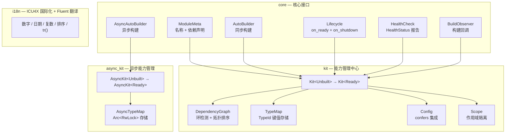

<div align="center">


[](https://github.com/Kirky-X/trait-kit/actions/workflows/ci.yml) [](https://crates.io/crates/trait-kit) [](https://docs.rs/trait-kit) [](https://crates.io/crates/trait-kit) [](https://github.com/Kirky-X/trait-kit/blob/main/LICENSE) [](https://www.rust-lang.org/)

**中文** | [English](https://github.com/Kirky-X/trait-kit/blob/main/README_EN.md)

**轻量级 Rust 库：标准化模块接口 + 集中式能力与配置管理中心（`Kit`）**

[✨ 功能特性](#-功能特性) • [🚀 快速开始](#-快速开始) • [📚 文档](#-文档) • [💻 示例](#-示例) • [🤝 参与贡献](#-参与贡献)

</div>

**trait-kit** 是一个轻量级 Rust 库，提供标准化的模块接口和集中式能力与配置管理中心（`Kit`）。采用 typestate 模式（`Kit<Unbuilt>` → `Kit<Ready>`）进行构建时验证，基于 `RefCell` 的内部可变性实现单线程设计（`!Sync`）。

---

## 📋 目录

<details open>
<summary>目录</summary>

- [✨ 功能特性](#-功能特性)
- [🚀 快速开始](#-快速开始)
  - [📦 安装](#-安装)
  - [💡 基本用法](#-基本用法)
  - [⚙️ 带配置的模块](#️-带配置的模块)
  - [🔗 带依赖的模块](#-带依赖的模块)
- [🎨 特性标志](#-特性标志)
- [📚 文档](#-文档)
- [💻 示例](#-示例)
- [🏗️ 架构](#️-架构)
- [⚙️ 配置：confers 集成](#️-配置confers-集成)
- [💡 为什么选择 trait-kit？](#-为什么选择-trait-kit)
- [🧪 测试](#-测试)
- [📊 性能](#-性能)
- [🔒 安全](#-安全)
- [🗺️ 开发路线图](#️-开发路线图)
- [🤝 参与贡献](#-参与贡献)
- [📋 更新日志](#-更新日志)
- [📄 许可证](#-许可证)
- [🙏 致谢](#-致谢)
- [📞 联系与支持](#-联系与支持)
- [⭐ Star 历史](#-star-历史)

</details>

---

## ✨ 功能特性

- **标准化模块接口** — `ModuleMeta` + `AutoBuilder` trait 定义统一契约，配合 `impl_module_meta!` / `impl_auto_builder!` 宏可一行声明模块。
- **Typestate 构建验证** — `Kit<Unbuilt>` 注册模块和配置；`kit.build()` 验证依赖图（环检测、缺失依赖检测）并返回 `Kit<Ready>`，构建错误在应用启动前暴露。
- **类型安全的能力检索** — 能力按模块类型存储和检索（`kit.require::<LoggerModule>()`），而非字符串键。无需 downcast，无需运行时查找。
- **配置中心** — `kit.set_config(value)` / `kit.config::<C>()` 通过 `TypeMap`（以 `TypeId` 为键）存储和检索类型化配置，无需 `ConfigKey` 或 `ConfigHandle` 样板代码。
- **可选 confers 集成** — 三级 feature flag 集成 [`confers`](https://crates.io/crates/confers)，支持 derive 宏配置加载、热重载订阅和 XChaCha20-Poly1305 加密配置存储。
- **`AsyncKit` 异步支持** — `async` feature 提供 `AsyncKit`，支持 `Send + Sync` 的异步能力管理，适用于数据库连接池、HTTP 客户端等异步初始化场景。
- **ICU4X 国际化** — 内置 ICU4X 支持，提供区域感知的数字、日期、复数和排序能力，以及基于 Fluent FTL 的中英文消息翻译（`tr()`）。
- **最小依赖** — 仅 `thiserror`、`icu`、`writeable`、`sys-locale` 为必需依赖。`confers`、`serde`、`serde_json` 均为可选，仅在启用对应 feature 时引入。
- **`#![deny(unsafe_code)]`** — 整个 crate 无任何 `unsafe` 代码。

---

## 🚀 快速开始

### 📦 安装

最低支持 Rust 版本（MSRV）：**1.97.1**。

```sh
cargo add trait-kit
```

### 💡 基本用法

定义一个 logger 模块，注册、构建 Kit，然后检索能力：

```rust
use std::sync::Arc;
use trait_kit::impl_module_meta;
use trait_kit::prelude::*;

// 1. 定义能力（任意 Clone 类型）
struct StdoutLogger;
impl StdoutLogger {
    fn info(&self, msg: &str) {
        println!("[LOG] {msg}");
    }
}

// 2. 定义模块（宏一行声明 ModuleMeta）
struct LoggerModule;
impl_module_meta!(LoggerModule, "logger");
impl AutoBuilder for LoggerModule {
    type Capability = Arc<StdoutLogger>;
    type Error = TraitKitError;
    fn build(_kit: &Kit) -> Result<Self::Capability, Self::Error> {
        Ok(Arc::new(StdoutLogger))
    }
}

// 3. 注册、构建、使用
fn main() {
    let mut kit = Kit::new();
    kit.register::<LoggerModule>().unwrap();
    let kit = kit.build().unwrap();

    let logger = kit.require::<LoggerModule>().unwrap();
    logger.info("Hello from trait-kit!");
    assert!(kit.contains::<LoggerModule>());
}
```

### ⚙️ 带配置的模块

配置是存储在 Kit 的 `TypeMap` 中的类型化值。模块在构建时通过 `kit.config::<C>()` 检索：

```rust
use std::sync::Arc;
use trait_kit::impl_module_meta;
use trait_kit::prelude::*;

#[derive(Clone, Debug)]
struct DbConfig {
    url: String,
    max_connections: u32,
}

struct DbPool {
    config: DbConfig,
}

struct DbPoolModule;
impl_module_meta!(DbPoolModule, "db-pool");
impl AutoBuilder for DbPoolModule {
    type Capability = Arc<DbPool>;
    type Error = TraitKitError;
    fn build(kit: &Kit) -> Result<Self::Capability, Self::Error> {
        let config: DbConfig = kit.config()?;
        Ok(Arc::new(DbPool { config }))
    }
}

fn main() {
    let mut kit = Kit::new();
    kit.set_config(DbConfig {
        url: "postgres://localhost".into(),
        max_connections: 10,
    });
    kit.register::<DbPoolModule>().unwrap();
    let kit = kit.build().unwrap();

    let pool = kit.require::<DbPoolModule>().unwrap();
    assert_eq!(pool.config.max_connections, 10);
}
```

### 🔗 带依赖的模块

模块通过 `impl_module_meta!` 宏声明依赖。Kit 在构建时验证依赖图，并按拓扑顺序构造模块：

```rust
use std::sync::Arc;
use trait_kit::impl_module_meta;
use trait_kit::prelude::*;

struct Logger;
impl Logger {
    fn info(&self, msg: &str) { println!("[LOG] {msg}"); }
}

struct LoggerModule;
impl_module_meta!(LoggerModule, "logger");
impl AutoBuilder for LoggerModule {
    type Capability = Arc<Logger>;
    type Error = TraitKitError;
    fn build(_kit: &Kit) -> Result<Self::Capability, Self::Error> {
        Ok(Arc::new(Logger))
    }
}

struct Storage {
    _logger: Arc<Logger>,
}

struct StorageModule;
impl_module_meta!(StorageModule, "storage", deps = [LoggerModule]);
impl AutoBuilder for StorageModule {
    type Capability = Arc<Storage>;
    type Error = TraitKitError;
    fn build(kit: &Kit) -> Result<Self::Capability, Self::Error> {
        let logger = kit.require::<LoggerModule>()?;
        Ok(Arc::new(Storage { _logger: logger }))
    }
}

fn main() {
    let mut kit = Kit::new();
    kit.register::<LoggerModule>().unwrap();
    kit.register::<StorageModule>().unwrap();
    let kit = kit.build().unwrap();

    let storage = kit.require::<StorageModule>().unwrap();
    let _ = storage;
}
```

完整的 `Kit<Unbuilt>` / `Kit<Ready>` 方法列表（含各 feature 门控）见 [📘 API 参考](https://github.com/Kirky-X/trait-kit/blob/main/docs/API_REFERENCE.md) 与 [docs.rs](https://docs.rs/trait-kit)。

---

## 🎨 特性标志

| Feature | 启用 | 说明 |
| --- | --- | --- |
| `default` | — | 无额外特性，仅核心 `Module` + `Kit`。 |
| `async` | — | `AsyncKit`：`Send + Sync` 异步能力管理，无需额外依赖。 |
| `confers` | `dep:confers`, `dep:serde`, `dep:serde_json` | `Configurable` + `ModuleConfig` trait + `Config` derive 宏再导出。 |
| `reload` | `confers`, `confers/watch` | `subscribe` / `reload_config` 热重载 API。 |
| `encryption` | `confers`, `confers/encryption` | `set_encrypted` / `get_encrypted` 加密配置存储。 |
| `interface` | — | 接口/实现分离：`register_as` / `resolve` 支持 `dyn Trait` 类型擦除注册与检索。 |
| `lifecycle` | — | 生命周期钩子：`on_ready`（构建后）+ `on_shutdown`（清理）。 |
| `health` | — | 健康检查：`HealthCheck` trait + `HealthStatus` 状态报告。 |
| `scope` | — | 作用域依赖：`Scope` 每请求实例隔离。 |
| `toggle` | — | 特性开关：运行时字符串键控的模块启用/禁用。 |
| `observer` | — | 构建可观测：`BuildObserver` 回调（开始/完成/错误）。 |
| `decorator` | — | 模块装饰器：构建后能力包装/增强。 |
| `shutdown` | — | 优雅关闭协调器：分阶段有序关闭 + 超时强退。 |
| `i18n` | `dep:icu`, `dep:writeable`, `dep:sys-locale` | ICU4X 国际化：本地化数字/日期/复数/排序格式化。 |

在 `Cargo.toml` 中启用所需级别：

```toml
[dependencies]
trait-kit = { version = "0.5.0-rc.2", features = ["encryption"] }
```

---

## 📚 文档

| 文档 | 说明 |
|------|------|
| [📖 用户指南](https://github.com/Kirky-X/trait-kit/blob/main/docs/USER_GUIDE.md) | 从安装到进阶的完整使用教程 |
| [📘 API 参考](https://github.com/Kirky-X/trait-kit/blob/main/docs/API_REFERENCE.md) | 全部公开 API 的详细说明 |
| [🏗️ 架构文档](https://github.com/Kirky-X/trait-kit/blob/main/docs/ARCHITECTURE.md) | 设计理念与内部实现 |
| [🔒 安全文档](https://github.com/Kirky-X/trait-kit/blob/main/docs/SECURITY.md) | 安全设计与最佳实践 |
| [📋 更新日志](https://github.com/Kirky-X/trait-kit/blob/main/docs/CHANGELOG.md) | 每个版本的变更记录 |
| [🤝 贡献指南](https://github.com/Kirky-X/trait-kit/blob/main/docs/CONTRIBUTING.md) | 如何参与项目开发 |
| [📦 在线 API 文档](https://docs.rs/trait-kit) | docs.rs 自动生成的最新文档 |

---

## 💻 示例

`examples/` 是一个独立的 workspace 成员 `trait-kit-examples`，覆盖全部公开 API 与 feature 门控。运行方式：

```sh
cargo run -p trait-kit-examples --example <名称> --features <特性>
```

| 示例 | Feature | 说明 |
|------|---------|------|
| `default_basic` | — | `ModuleMeta` + `AutoBuilder` + `Kit` 注册/构建/检索基础流程 |
| `conditional` | — | `register_if::<M>(predicate)` 运行时谓词条件注册 |
| `factory` | — | `Kit<Ready>::factory::<M>()` 每次调用创建新实例（对比单例 `require()`） |
| `interface` | `interface` | `InterfaceBuilder` + `register_as` / `resolve::<dyn Trait>()` 类型擦除 DI |
| `lifecycle` | `lifecycle` | `Lifecycle` trait（`on_ready` + `on_shutdown`）+ `Kit::shutdown()` |
| `health_check` | `health` | `HealthCheck` trait + `HealthStatus` + `health_report` |
| `observability` | `observer` | `BuildObserver` 回调（`on_module_start` / `on_module_built`） |
| `confers_loader` | `confers` | `#[derive(Config)]` + `Configurable` + `Kit::load_config`（环境变量加载） |
| `confers_macros` | `confers` | `ModuleConfig` trait（`PATH` + `default_value`）+ 构建时消费配置 |
| `validation` | `confers` | `Validatable` trait + `Kit::load_and_validate` 配置验证 |
| `snapshot_restore` | `confers` | `snapshot_config` / `restore_config` / `has_snapshot` 配置快照与回滚 |
| `config_inheritance` | `confers` | 四层配置继承体系（`merge_json_deep` → `ConfigInherit` → `SharedConfig` → `populate_defaults`） |
| `hot_reload` | `reload` | `subscribe::<C>` + `reload_config::<C>` 热重载订阅 |
| `encryption` | `encryption` | `set_encrypted` / `get_encrypted` 加密存取 + 错误密钥拒绝 |
| `async_basic` | `async` | `AsyncAutoBuilder` + `AsyncKit` 异步注册/构建/检索 |
| `scope_basic` | `scope` | `Scope` 每请求实例隔离 + 懒构建缓存 |
| `toggle_basic` | `toggle` | `enable_toggle` / `is_toggle_enabled` / `register_if_toggle` 运行时开关 |
| `decorator` | `decorator` | `Kit::decorate::<M>(fn)` 构建后能力包装 |
| `shutdown` | `shutdown` | `ShutdownCoordinator` 分阶段优雅关闭（`StopRequests` → `DrainQueue` → `CloseConnections`）+ 超时控制 |
| `i18n` | `i18n` | `I18nFormatter` 本地化数字/日期/复数/排序 |

示例详情见 [examples/README.md](https://github.com/Kirky-X/trait-kit/blob/main/examples/README.md)。

---

## 🏗️ 架构



**核心设计**：

- **Typestate 模式**：`Kit<Unbuilt>` → `Kit<Ready>`，构建时验证依赖图，运行时零开销。
- **内部可变性**：基于 `RefCell`，单线程 `!Sync` 设计，避免锁开销。`AsyncKit` 使用 `Arc<RwLock>` 支持多线程。
- **三级 Feature 继承**（confers 集成）：


更多设计细节（依赖图验证、数据流、线程安全模型、目录结构）见 [架构文档](https://github.com/Kirky-X/trait-kit/blob/main/docs/ARCHITECTURE.md)。

---

## ⚙️ 配置：confers 集成

trait-kit 通过三级 feature flag 集成 [`confers`](https://crates.io/crates/confers) 0.6。每个级别继承前一级别，形成分层能力系统。

### confers 特性标志

| Feature               | 启用                                            | 说明                                           |
| --------------------- | ----------------------------------------------- | ---------------------------------------------- |
| `confers`             | `dep:confers`, `dep:serde`, `dep:serde_json`    | `Configurable` + `ModuleConfig` trait + `Config` derive 宏再导出。 |
| `reload`  | `confers`, `confers/watch`               | `subscribe` / `reload_config` API。             |
| `encryption`  | `confers`, `confers/encryption` | `set_encrypted` / `get_encrypted` API。  |

### 三级继承体系

1. **模块能力继承**（第一层）：`ModuleConfig` trait 声明 `PATH` 和 `default_value()`，将配置类型绑定到模块的配置路径。

2. **Cargo feature 继承**（第二层）：每个 feature 级别继承前一级别（`encryption` → `reload` → `confers`）。启用高级别会自动启用所有低级别。

3. **配置值继承**（第三层）：加密密钥通过 HKDF 从 `ModuleConfig::PATH` 派生，因此同一主密钥可为不同模块生成不同的字段密钥。

### 第一级：配置加载模式

定义 `Configurable` 实现，桥接 confers 的 `#[derive(Config)]` 宏：

```rust,ignore
use trait_kit::prelude::*;
use trait_kit::kit::Config;

#[derive(Debug, Clone, PartialEq, serde::Deserialize, Config)]
#[config(env_prefix = "APP_")]
struct AppConfig {
    #[config(default = "localhost".to_string())]
    host: String,
}

impl Configurable for AppConfig {
    fn load() -> Result<Self, Box<dyn std::error::Error>> {
        Ok(AppConfig::load_sync()?)
    }
}

let kit = Kit::new();
kit.load_config::<AppConfig>()?;  // 通过 confers 从环境变量/默认值加载
let kit = kit.build()?;
let config: AppConfig = kit.config()?;
```

### 第二级：模块配置元数据

添加 `ModuleConfig` 以声明配置路径和默认值：

```rust,ignore
use trait_kit::kit::config::ModuleConfig;

impl ModuleConfig for AppConfig {
    const PATH: &'static str = "config/app.toml";
    fn default_value() -> Self {
        Self { host: "localhost".to_string() }
    }
}
```

### 第三级：热重载订阅

订阅配置重载时触发的回调：

```rust,ignore
use std::cell::Cell;
use std::rc::Rc;

let kit = Kit::new();
let called = Rc::new(Cell::new(false));
let called_clone = Rc::clone(&called);
kit.subscribe::<AppConfig>(move || {
    called_clone.set(true);
});

kit.reload_config::<AppConfig>()?;  // 通过 Configurable::load 重载，通知订阅者
assert!(called.get());
```

### 第四级：加密配置存储

使用 XChaCha20-Poly1305 加密静态配置。加密密钥通过 HKDF 从主密钥和 `ModuleConfig::PATH` 派生：

```rust,ignore
let kit = Kit::new();
let secret = AppConfig { host: "production-db".to_string() };
let master_key = [0u8; 32]; // 32 字节主密钥

kit.set_encrypted(&secret, &master_key)?;
let kit = kit.build()?;

// 只有正确的主密钥才能解密
let decrypted: AppConfig = kit.get_encrypted(&master_key)?;
assert_eq!(decrypted, secret);
```

### 第五级：配置继承（跨模块/跨项目）

四层配置继承体系，支持项目 A 的配置丝滑继承到项目 B：

```rust,ignore
use trait_kit::kit::{Kit, ModuleConfig};
use trait_kit_derive::{ConfigInherit, SharedConfig};

// 声明共享字段
#[derive(Clone, ConfigInherit, SharedConfig)]
#[shared(host, port)]
struct DbConfig {
    host: String,
    port: u16,
    max_connections: u32,
}

let kit = Kit::new();
kit.populate_defaults::<DbConfig>();       // 零配置默认值
kit.extract_shared::<AppConfig>();         // 从 AppConfig 提取共享字段
kit.inject_shared::<DbConfig>();           // 注入到 DbConfig
kit.merge_config::<DbConfig>(ovr);         // 编译期安全字段覆盖
```

- `trait-kit-derive` 提供 `#[derive(ConfigInherit)]` 和 `#[derive(SharedConfig)]` 宏
- 共享字段使用 `serde_json::Value` 保留类型信息
- `AsyncKit` 提供完全对称的 `Send + Sync` API

---

## 💡 为什么选择 trait-kit？

trait-kit 定位在"手动装配"和"完整 DI 框架"之间：

| 方案                     | 优点                                | 缺点                               |
| ------------------------ | ----------------------------------- | ---------------------------------- |
| **手动装配**             | 简单，无依赖。                      | 模式不统一，每个项目各自为政。     |
| **trait-kit**            | 标准化模式，类型安全，轻量级。      | 仍需显式声明依赖关系。             |
| **完整 DI（shaku 等）**  | 自动解析，更少胶水代码。            | 依赖更重，魔法行为，调试困难。     |

trait-kit 提供 DI 框架的**标准化**，同时保持手动装配的**显式性**。

---

## 🧪 测试

### 测试分类

| 类型 | 位置 | 说明 |
|------|------|------|
| 单元测试 | `src/`（`#[cfg(test)]`） | 模块内部逻辑 |
| 集成测试 | `tests/` | `basic`、`e2e_advanced`、`e2e_feature_combinations`、`config_inheritance_e2e`、`config_inherit_derive`、`shared_config_derive` 等 |
| 编译期 UI 测试 | `tests/compile_fail.rs` + `tests/ui/` | 基于 trybuild，断言 typestate 误用（未构建即检索等）产生编译错误 |
| 示例验证 | `examples/` | 每个示例可独立运行，断言失败即 panic |

### 常用命令

```sh
# 运行所有测试（默认特性）
cargo test

# 运行所有测试（全部特性，与 CI 一致）
cargo test --all-features --lib

# 按特性组合运行
cargo test --features confers

# Lint 与格式检查
cargo clippy --all-targets --all-features -- -D warnings
cargo fmt --all -- --check
```

---

## 📊 性能

性能来自设计层面的考量，而非运行时开销的堆叠：

- **构建期验证，运行时零开销**：typestate 模式将依赖图验证（环检测、缺失依赖）全部前置到 `build()`，`Kit<Ready>` 上的能力检索只是 `TypeId` 查表 + 克隆。
- **无锁单线程设计**：同步 `Kit` 基于 `RefCell` 内部可变性，避免互斥锁开销；多线程场景使用 `AsyncKit`（`Arc<RwLock>`）。
- **持续优化**：0.4.1 对 `Kit::require()`、`reload_config()`、`transfer_lazy_builders()` 做了优化，`find_cycle()` 使用 `HashMap` 实现 O(1) 栈位置查找（见 [CHANGELOG](https://github.com/Kirky-X/trait-kit/blob/main/docs/CHANGELOG.md)）。

系统化的性能基准测试规划中（详见 [开发路线图](#️-开发路线图)），当前暂无公开基准数据。

---

## 🔒 安全

- **`#![deny(unsafe_code)]`**：整个 crate 无任何 `unsafe` 代码。
- **加密配置存储**：`encryption` feature 提供 XChaCha20-Poly1305 加密，密钥通过 HKDF 从主密钥与 `ModuleConfig::PATH` 派生；`EncryptedBlob` 的 `Debug` 实现不泄露加密材料。
- **线程安全模型明确**：同步 `Kit` 为 `!Sync`（文档化的线程安全边界），`AsyncKit` 为 `Send + Sync`。
- **CI 安全门禁**：`cargo deny check` 依赖审计 + `CodeQL` 静态分析。

详见 [安全文档](https://github.com/Kirky-X/trait-kit/blob/main/docs/SECURITY.md)。

---

## 🗺️ 开发路线图

素材来自工作区验收计划与 [CHANGELOG](https://github.com/Kirky-X/trait-kit/blob/main/docs/CHANGELOG.md)：

- [x] **0.5.0-rc.2**（2026-09-03）— 文档与 Kit API 表同步、workspace 依赖路径本地化（`path` + `version` 双写）。
- [ ] **0.5.0 正式发布** — 版本次位 +1 后，按工作区发布计划同步下游仓库（oxcache、dbnexus、inklog、limiteron、sdforge）对本 crate 的 `path + version` 依赖要求。
- [ ] **cfg 门控完整性** — 补齐 `--no-default-features --features async` 组合下 `observer` 相关的 cfg 门控（已知低优先级项）。
- [ ] **性能基准测试** — 建立 criterion 基准与 `docs/PERFORMANCE.md` 性能报告（规划中）。

---

## 🤝 参与贡献

欢迎参与贡献！完整的开发环境准备、TDD 工作流与提交规范请参见 [贡献指南](https://github.com/Kirky-X/trait-kit/blob/main/docs/CONTRIBUTING.md)。

### 构建要求

- Rust **1.97.1** 或更高版本（stable）。
- 无需外部工具链（无 protoc、无 openssl、无系统库）。

### 开发命令

```sh
# 运行所有测试（默认特性）
cargo test

# 运行所有测试（全部 confers 特性）
cargo test --all-features

# Lint
cargo clippy --all-features -- -D warnings

# 格式检查
cargo fmt --check
```

### 行为准则

本项目遵循 [Rust 行为准则](https://www.rust-lang.org/policies/code-of-conduct)。所有贡献者均需遵守。

### PR 流程

1. 确保所有测试通过且 Clippy 无警告（`cargo clippy --all-features -- -D warnings`）。
2. 为新功能添加测试。
3. 保持 README 与 API 变更同步。

---

## 📋 更新日志

详见 [CHANGELOG.md](https://github.com/Kirky-X/trait-kit/blob/main/docs/CHANGELOG.md)。近期版本要点：

- **0.5.0-rc.2**（2026-09-03）：文档版本号与 Kit API 表格同步；`confers` 依赖路径本地化（`path` + `version` 双写）。
- **0.4.2**（2026-08-06）：修复 `AsyncKit::decorate()` 装饰器存储键错误（decorator 此前从未生效）。
- **0.4.1**（2026-08-06）：国际化增强（`tr()` / `I18nManager` 不再依赖 `i18n` feature）；`EncryptedBlob` Debug 不再泄露加密材料；新增配置扩展 API 文档与示例。

---

## 📄 许可证

本项目基于 MIT + Commons Clause 许可证发布，商业使用需单独授权。详见 [LICENSE](https://github.com/Kirky-X/trait-kit/blob/main/LICENSE)。

Copyright (c) 2026 Kirky.X

---

## 🙏 致谢

- [`confers`](https://crates.io/crates/confers) — 配置加载、热重载与加密存储的底层能力。
- [ICU4X](https://github.com/unicode-org/icu4x) — 国际化格式化（数字/日期/复数/排序）。
- [Project Fluent](https://projectfluent.org/) — Fluent FTL 消息本地化方案。
- [Rust 社区](https://www.rust-lang.org/community) — 优秀的语言生态与工具链。

---

## 📞 联系与支持

- **Bug 与功能建议**：[GitHub Issues](https://github.com/Kirky-X/trait-kit/issues)
- **安全漏洞**：请勿通过公开 Issue 报告，参见 [安全文档](https://github.com/Kirky-X/trait-kit/blob/main/docs/SECURITY.md) 的漏洞报告流程。
- **维护者**：Kirky.X

---

## ⭐ Star 历史

[](https://star-history.com/#Kirky-X/trait-kit&Date)

### 💝 支持本项目

如果您觉得这个项目有用，请考虑给它一个 ⭐️！
