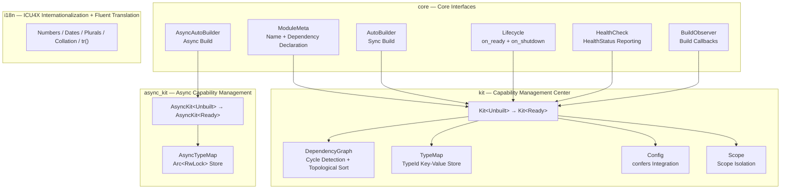

<div align="center">

<p align="center">
  
</p>

[![CI][ci-badge]][ci-url] [![crates.io][crates-badge]][crates-url] [![docs.rs][docs-badge]][docs-url] [![downloads][downloads-badge]][downloads-url] [![MIT licensed][license-badge]][license-url] [![MSRV][msrv-badge]][msrv-url]

[中文](./README.md) | English

</div>

**trait-kit** is a lightweight Rust library that provides a standardized module interface and a centralized capability & configuration management center (`Kit`). It uses a typestate pattern (`Kit<Unbuilt>` → `Kit<Ready>`) for build-time validation, with `RefCell`-based interior mutability for single-threaded, `!Sync` by design.

---

## ✨ Features

- **Standardized Module Interface** — The `ModuleMeta` + `AutoBuilder` traits define a uniform contract, with `impl_module_meta!` / `impl_auto_builder!` macros for one-line module declarations.
- **Typestate Build Validation** — `Kit<Unbuilt>` registers modules and configs; `kit.build()` validates the dependency graph (cycle detection, missing deps) and returns `Kit<Ready>`. Build errors surface before your app starts.
- **Type-Safe Capability Retrieval** — Capabilities are stored and retrieved by module type (`kit.require::<LoggerModule>()`), not string keys. No downcasting, no runtime lookups.
- **Configuration Center** — `kit.set_config(value)` / `kit.config::<C>()` store and retrieve typed configs via a `TypeMap` keyed by `TypeId`. No `ConfigKey` or `ConfigHandle` boilerplate.
- **Optional confers Integration** — Four-level feature flags integrate [`confers`](https://crates.io/crates/confers) for derive-macro config loading, hot-reload subscriptions, and XChaCha20-Poly1305 encrypted config storage.
- **`AsyncKit` Async Support** — The `async` feature provides `AsyncKit` with `Send + Sync` async capability management for database pools, HTTP clients, and other async initialization scenarios.
- **ICU4X Internationalization** — Built-in ICU4X support for locale-aware number, date, plural, and collation formatting, plus Fluent FTL-based message translation (`tr()`) for multilingual error messages.
- **Minimal Dependencies** — Only `thiserror`, `icu`, `writeable`, and `sys-locale` are required. `confers`, `serde`, and `serde_json` are optional, pulled in only when you enable the corresponding feature.
- **`#![deny(unsafe_code)]`** — No `unsafe` anywhere in the crate.

---

## 📦 Quick Start

### MSRV

Minimum Supported Rust Version: **1.91**

### Installation

```sh
cargo add trait-kit
```

### Minimal Example

Define a logger module, register it, build the Kit, and retrieve the capability:

```rust
use std::sync::Arc;
use trait_kit::impl_module_meta;
use trait_kit::prelude::*;

// 1. Define a capability (any Clone type)
struct StdoutLogger;
impl StdoutLogger {
    fn info(&self, msg: &str) {
        println!("[LOG] {msg}");
    }
}

// 2. Define a module (macro for ModuleMeta)
struct LoggerModule;
impl_module_meta!(LoggerModule, "logger");
impl AutoBuilder for LoggerModule {
    type Capability = Arc<StdoutLogger>;
    type Error = TraitKitError;
    fn build(_kit: &Kit) -> Result<Self::Capability, Self::Error> {
        Ok(Arc::new(StdoutLogger))
    }
}

// 3. Register, build, and use
fn main() {
    let mut kit = Kit::new();
    kit.register::<LoggerModule>().unwrap();
    let kit = kit.build().unwrap();

    let logger = kit.require::<LoggerModule>().unwrap();
    logger.info("Hello from trait-kit!");
    assert!(kit.contains::<LoggerModule>());
}
```

---

## 🔧 Usage

### Module with Configuration

Configs are typed values stored in the Kit's `TypeMap`. Modules retrieve them via `kit.config::<C>()` during build:

```rust
use std::sync::Arc;
use trait_kit::impl_module_meta;
use trait_kit::prelude::*;

#[derive(Clone, Debug)]
struct DbConfig {
    url: String,
    max_connections: u32,
}

struct DbPool {
    config: DbConfig,
}

struct DbPoolModule;
impl_module_meta!(DbPoolModule, "db-pool");
impl AutoBuilder for DbPoolModule {
    type Capability = Arc<DbPool>;
    type Error = TraitKitError;
    fn build(kit: &Kit) -> Result<Self::Capability, Self::Error> {
        let config: DbConfig = kit.config()?;
        Ok(Arc::new(DbPool { config }))
    }
}

fn main() {
    let mut kit = Kit::new();
    kit.set_config(DbConfig {
        url: "postgres://localhost".into(),
        max_connections: 10,
    });
    kit.register::<DbPoolModule>().unwrap();
    let kit = kit.build().unwrap();

    let pool = kit.require::<DbPoolModule>().unwrap();
    assert_eq!(pool.config.max_connections, 10);
}
```

### Module with Dependencies

Modules declare dependencies via `impl_module_meta!` macro. The Kit validates the dependency graph at build time and constructs modules in topological order:

```rust
use std::sync::Arc;
use trait_kit::impl_module_meta;
use trait_kit::prelude::*;

struct Logger;
impl Logger {
    fn info(&self, msg: &str) { println!("[LOG] {msg}"); }
}

struct LoggerModule;
impl_module_meta!(LoggerModule, "logger");
impl AutoBuilder for LoggerModule {
    type Capability = Arc<Logger>;
    type Error = TraitKitError;
    fn build(_kit: &Kit) -> Result<Self::Capability, Self::Error> {
        Ok(Arc::new(Logger))
    }
}

struct Storage {
    _logger: Arc<Logger>,
}

struct StorageModule;
impl_module_meta!(StorageModule, "storage", deps = [LoggerModule]);
impl AutoBuilder for StorageModule {
    type Capability = Arc<Storage>;
    type Error = TraitKitError;
    fn build(kit: &Kit) -> Result<Self::Capability, Self::Error> {
        let logger = kit.require::<LoggerModule>()?;
        Ok(Arc::new(Storage { _logger: logger }))
    }
}

fn main() {
    let mut kit = Kit::new();
    kit.register::<LoggerModule>().unwrap();
    kit.register::<StorageModule>().unwrap();
    let kit = kit.build().unwrap();

    let storage = kit.require::<StorageModule>().unwrap();
    let _ = storage;
}
```

### Kit API Overview

| Method                              | Available on    | Description                                            |
| ----------------------------------- | --------------- | ------------------------------------------------------ |
| `Kit::new()`                        | —               | Create an empty `Kit<Unbuilt>`.                        |
| `kit.register::<M>()`              | `Kit<Unbuilt>`  | Register a module for construction.                    |
| `kit.register_lazy::<M>()`         | `Kit<Unbuilt>`  | Register for lazy construction on first `require()`.   |
| `kit.register_multi::<M>()`        | `Kit<Unbuilt>`  | Register multi-binding (same capability type).         |
| `kit.register_as::<M>()`           | `Kit<Unbuilt>`  | Register by interface type (`dyn Trait`).              |
| `kit.register_if::<M>()`           | `Kit<Unbuilt>`  | Conditional registration (runtime predicate).          |
| `kit.register_lifecycle::<M>()`    | `Kit<Unbuilt>`  | Register lifecycle hooks for a module.                 |
| `kit.register_health_check::<M>()` | `Kit<Unbuilt>`  | Register health check for a module.                    |
| `kit.with_observer(obs)`           | `Kit<Unbuilt>`  | Attach a `BuildObserver` for build callbacks.          |
| `kit.decorate::<M>(f)`             | `Kit<Unbuilt>`  | Post-build capability wrapping/enhancement.            |
| `kit.set_config::<C>(value)`       | Both            | Store a typed config value.                            |
| `kit.config::<C>()`                | Both            | Retrieve a cloned config value.                        |
| `kit.build()`                       | `Kit<Unbuilt>`  | Validate graph and build all modules → `Kit<Ready>`.   |
| `kit.require::<M>()`               | `Kit<Ready>`    | Retrieve a capability (errors if missing).             |
| `kit.require_ref::<M>()`           | `Kit<Ready>`    | Zero-copy capability retrieval (`Ref<'_, Cap>`).      |
| `kit.optional::<M>()`              | `Kit<Ready>`    | Retrieve a capability (returns `None` if missing).     |
| `kit.require_all::<M>()`           | `Kit<Ready>`    | Return all multi-binding capabilities.                 |
| `kit.resolve::<I>()`               | `Kit<Ready>`    | Retrieve by interface type (`Arc<I>`).                 |
| `kit.contains::<M>()`              | `Kit<Ready>`    | Check if a capability was built.                       |
| `kit.contains_config::<C>()`       | `Kit<Ready>`    | Check if a config value exists.                        |
| `kit.health_check::<M>()`          | `Kit<Ready>`    | Run health check for a module.                         |
| `kit.health_report()`              | `Kit<Ready>`    | Return health report for all modules.                  |
| `kit.shutdown()`                   | `Kit<Ready>`    | Run `on_shutdown` in reverse topological order.        |

---

## 🏷️ Feature Flags

| Feature | Enables | Description |
| --- | --- | --- |
| `default` | — | No extra features, just core `Module` + `Kit`. |
| `async` | — | `AsyncKit`: `Send + Sync` async capability management, no extra deps. |
| `confers` | `dep:confers`, `dep:serde` | `Configurable` trait + `Kit::load_config`. |
| `confers-macros` | `confers` | `ModuleConfig` trait + `Config` derive re-export. |
| `hot-reload` | `confers-macros`, `confers/watch` | `subscribe` / `reload_config` hot-reload API. |
| `encryption` | `hot-reload`, `confers/encryption`, `dep:serde_json` | `set_encrypted` / `get_encrypted` encrypted config storage. |
| `interface` | — | Interface/implementation separation: `register_as` / `resolve` with `dyn Trait` type erasure. |
| `lifecycle` | — | Lifecycle hooks: `on_ready` (after build) + `on_shutdown` (cleanup). |
| `health` | — | Health checks: `HealthCheck` trait + `HealthStatus` reporting. |
| `scope` | — | Scoped dependencies: `Scope` per-request instance isolation. |
| `conditional` | — | Conditional registration: runtime predicate-controlled module registration. |
| `observability` | — | Build observability: `BuildObserver` callbacks (start/complete/error). |
| `factory` | — | Factory pattern: new instance per call (non-singleton). |
| `decorator` | — | Module decorator: post-build capability wrapping/enhancement. |
| `shutdown` | — | Graceful shutdown coordinator: phased shutdown with hook registration + timeout. |

Enable the desired level in `Cargo.toml`:

```toml
[dependencies]
trait-kit = { version = "0.4", features = ["encryption"] }
```

---

## ⚙️ Configuration: confers Integration

trait-kit integrates with [`confers`](https://crates.io/crates/confers) 0.5 via four-level feature flags. Each level inherits from the previous, forming a layered capability system.

### confers Feature Flags

| Feature               | Enables                                         | Description                                      |
| --------------------- | ----------------------------------------------- | ------------------------------------------------ |
| `confers`             | `dep:confers`, `dep:serde`                      | `Configurable` trait + `Kit::load_config`.       |
| `confers-macros`      | `confers`                                       | `ModuleConfig` trait + `Config` derive re-export.|
| `hot-reload`  | `confers-macros`, `confers/watch`               | `subscribe` / `reload_config` API.               |
| `encryption`  | `hot-reload`, `confers/encryption`, `dep:serde_json` | `set_encrypted` / `get_encrypted` API.    |

### Three-Tier Inheritance System

1. **Module capability inheritance** (Layer 1): `ModuleConfig` trait declares `PATH` and `default_value()`, binding a config type to its module's configuration path.

2. **Cargo feature inheritance** (Layer 2): Each feature level inherits the previous (`encryption` → `hot-reload` → `confers-macros` → `confers`). Enabling a higher level automatically enables all lower levels.

3. **Config value inheritance** (Layer 3): The encryption key is derived from `ModuleConfig::PATH` via HKDF, so the same master key produces different field keys for different modules.

### Level 1: Config Loader Pattern

Define a `Configurable` implementation that bridges to confers' `#[derive(Config)]` macro:

```rust,ignore
use trait_kit::prelude::*;
use trait_kit::kit::Config;

#[derive(Debug, Clone, PartialEq, serde::Deserialize, Config)]
#[config(env_prefix = "APP_")]
struct AppConfig {
    #[config(default = "localhost".to_string())]
    host: String,
}

impl Configurable for AppConfig {
    fn load() -> Result<Self, Box<dyn std::error::Error>> {
        Ok(AppConfig::load_sync()?)
    }
}

let kit = Kit::new();
kit.load_config::<AppConfig>()?;  // loads from env/defaults via confers
let kit = kit.build()?;
let config: AppConfig = kit.config()?;
```

### Level 2: Module Config Metadata

Add `ModuleConfig` to declare the config path and default value:

```rust,ignore
use trait_kit::kit::config::ModuleConfig;

impl ModuleConfig for AppConfig {
    const PATH: &'static str = "config/app.toml";
    fn default_value() -> Self {
        Self { host: "localhost".to_string() }
    }
}
```

### Level 3: Hot-Reload Subscriptions

Subscribe callbacks that fire when a config is reloaded:

```rust,ignore
use std::cell::Cell;
use std::rc::Rc;

let kit = Kit::new();
let called = Rc::new(Cell::new(false));
let called_clone = Rc::clone(&called);
kit.subscribe::<AppConfig>(move || {
    called_clone.set(true);
});

kit.reload_config::<AppConfig>()?;  // reloads via Configurable::load, notifies subscribers
assert!(called.get());
```

### Level 4: Encrypted Config Storage

Encrypt configs at rest with XChaCha20-Poly1305. The encryption key is derived from the master key and `ModuleConfig::PATH` via HKDF:

```rust,ignore
let kit = Kit::new();
let secret = AppConfig { host: "production-db".to_string() };
let master_key = [0u8; 32]; // 32-byte master key

kit.set_encrypted(&secret, &master_key)?;
let kit = kit.build()?;

// Only retrievable with the correct master key
let decrypted: AppConfig = kit.get_encrypted(&master_key)?;
assert_eq!(decrypted, secret);
```

---

## 🏗️ Architecture



**Core Design**:

- **Typestate Pattern**: `Kit<Unbuilt>` → `Kit<Ready>`, build-time dependency graph validation, zero runtime overhead.
- **Interior Mutability**: `RefCell`-based, single-threaded `!Sync` design, avoiding lock overhead. `AsyncKit` uses `Arc<RwLock>` for multi-threading.
- **Four-Level Feature Inheritance** (confers integration):


---

## 💡 Why trait-kit?

trait-kit sits between "raw manual wiring" and "full DI framework":

| Approach                 | Pros                                      | Cons                                       |
| ------------------------ | ----------------------------------------- | ------------------------------------------ |
| **Manual wiring**        | Simple, no deps.                          | Ad-hoc patterns, inconsistent per project. |
| **trait-kit**            | Standard pattern, type-safe, lightweight. | You still wire dependencies explicitly.    |
| **Full DI (shaku etc.)** | Auto-resolved, less glue code.            | Heavier deps, magic, harder to debug.      |

trait-kit gives you the **standardization** of a DI framework with the **explicitness** of manual wiring.

---

## 🤝 Contributing

### Build Requirements

- Rust **1.91** or later (stable).
- No external tooling required (no protoc, no openssl, no system libraries).

### Development Commands

```sh
# Run all tests (default features)
cargo test

# Run all tests (all confers features)
cargo test --all-features

# Lint
cargo clippy --all-features -- -D warnings

# Format check
cargo fmt --check
```

### Code of Conduct

This project follows the [Rust Code of Conduct](https://www.rust-lang.org/policies/code-of-conduct). All contributors are expected to uphold it.

### Pull Request Process

1. Ensure all tests pass and Clippy is clean (`cargo clippy --all-features -- -D warnings`).
2. Add tests for new functionality.
3. Keep the README in sync with any API changes.

---

## 📚 Documentation

- [API Docs (docs.rs)][docs-url]
- [Architecture](docs/ARCHITECTURE.md)
- [API Reference](docs/API.md)
- [Changelog](docs/CHANGELOG.md)
- [Contributing](docs/CONTRIBUTING.md)

---

## 📋 Changelog

See [CHANGELOG.md](CHANGELOG.md).

---

## 📄 License

MIT License, Copyright (c) 2026 Kirky.X

See [LICENSE](https://github.com/Kirky-X/trait-kit/blob/main/LICENSE).

[ci-badge]: https://github.com/Kirky-X/trait-kit/actions/workflows/ci.yml/badge.svg
[ci-url]: https://github.com/Kirky-X/trait-kit/actions/workflows/ci.yml
[crates-badge]: https://img.shields.io/crates/v/trait-kit?style=flat-square
[crates-url]: https://crates.io/crates/trait-kit
[docs-badge]: https://img.shields.io/docsrs/trait-kit?style=flat-square
[docs-url]: https://docs.rs/trait-kit
[downloads-badge]: https://img.shields.io/crates/d/trait-kit?style=flat-square
[downloads-url]: https://crates.io/crates/trait-kit
[license-badge]: https://img.shields.io/badge/license-MIT-blue?style=flat-square
[license-url]: https://github.com/Kirky-X/trait-kit/blob/main/LICENSE
[msrv-badge]: https://img.shields.io/badge/MSRV-1.91-orange?style=flat-square
[msrv-url]: https://github.com/Kirky-X/trait-kit
