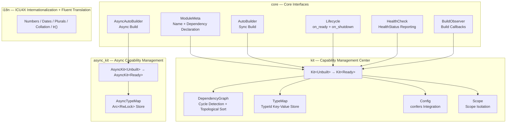

<div align="center">


[](https://github.com/Kirky-X/trait-kit/actions/workflows/ci.yml) [](https://crates.io/crates/trait-kit) [](https://docs.rs/trait-kit) [](https://crates.io/crates/trait-kit) [](LICENSE) [](https://www.rust-lang.org/)

[中文](README.md) | **English**

**A lightweight Rust library: standardized module interface + centralized capability & configuration management center (`Kit`)**

[✨ Features](#-features) • [🚀 Quick Start](#-quick-start) • [📚 Documentation](#-documentation) • [💻 Examples](#-examples) • [🤝 Contributing](#-contributing)

</div>

**trait-kit** is a lightweight Rust library that provides a standardized module interface and a centralized capability & configuration management center (`Kit`). It uses a typestate pattern (`Kit<Unbuilt>` → `Kit<Ready>`) for build-time validation, with `RefCell`-based interior mutability for single-threaded, `!Sync` by design.

---

## 📋 Table of Contents

<details open>
<summary>Table of Contents</summary>

- [✨ Features](#-features)
- [🚀 Quick Start](#-quick-start)
  - [📦 Installation](#-installation)
  - [💡 Basic Usage](#-basic-usage)
  - [⚙️ Module with Configuration](#️-module-with-configuration)
  - [🔗 Module with Dependencies](#-module-with-dependencies)
- [🎨 Feature Flags](#-feature-flags)
- [📚 Documentation](#-documentation)
- [💻 Examples](#-examples)
- [🏗️ Architecture](#️-architecture)
- [⚙️ Configuration: confers Integration](#️-configuration-confers-integration)
- [💡 Why trait-kit?](#-why-trait-kit)
- [🧪 Testing](#-testing)
- [📊 Performance](#-performance)
- [🔒 Security](#-security)
- [🗺️ Roadmap](#️-roadmap)
- [🤝 Contributing](#-contributing)
- [📋 Changelog](#-changelog)
- [📄 License](#-license)
- [🙏 Acknowledgments](#-acknowledgments)
- [📞 Contact & Support](#-contact--support)
- [⭐ Star History](#-star-history)

</details>

---

## ✨ Features

- **Standardized Module Interface** — The `ModuleMeta` + `AutoBuilder` traits define a uniform contract, with `impl_module_meta!` / `impl_auto_builder!` macros for one-line module declarations.
- **Typestate Build Validation** — `Kit<Unbuilt>` registers modules and configs; `kit.build()` validates the dependency graph (cycle detection, missing deps) and returns `Kit<Ready>`. Build errors surface before your app starts.
- **Type-Safe Capability Retrieval** — Capabilities are stored and retrieved by module type (`kit.require::<LoggerModule>()`), not string keys. No downcasting, no runtime lookups.
- **Configuration Center** — `kit.set_config(value)` / `kit.config::<C>()` store and retrieve typed configs via a `TypeMap` keyed by `TypeId`. No `ConfigKey` or `ConfigHandle` boilerplate.
- **Optional confers Integration** — Three-level feature flags integrate [`confers`](https://crates.io/crates/confers) for derive-macro config loading, hot-reload subscriptions, and XChaCha20-Poly1305 encrypted config storage.
- **`AsyncKit` Async Support** — The `async` feature provides `AsyncKit` with `Send + Sync` async capability management for database pools, HTTP clients, and other async initialization scenarios.
- **ICU4X Internationalization** — Built-in ICU4X support for locale-aware number, date, plural, and collation formatting, plus Fluent FTL-based message translation (`tr()`) for multilingual error messages.
- **Minimal Dependencies** — Only `thiserror`, `icu`, `writeable`, and `sys-locale` are required. `confers`, `serde`, and `serde_json` are optional, pulled in only when you enable the corresponding feature.
- **`#![deny(unsafe_code)]`** — No `unsafe` anywhere in the crate.

---

## 🚀 Quick Start

### 📦 Installation

Minimum Supported Rust Version (MSRV): **1.97.1**.

```sh
cargo add trait-kit
```

### 💡 Basic Usage

Define a logger module, register it, build the Kit, and retrieve the capability:

```rust
use std::sync::Arc;
use trait_kit::impl_module_meta;
use trait_kit::prelude::*;

// 1. Define a capability (any Clone type)
struct StdoutLogger;
impl StdoutLogger {
    fn info(&self, msg: &str) {
        println!("[LOG] {msg}");
    }
}

// 2. Define a module (macro for ModuleMeta)
struct LoggerModule;
impl_module_meta!(LoggerModule, "logger");
impl AutoBuilder for LoggerModule {
    type Capability = Arc<StdoutLogger>;
    type Error = TraitKitError;
    fn build(_kit: &Kit) -> Result<Self::Capability, Self::Error> {
        Ok(Arc::new(StdoutLogger))
    }
}

// 3. Register, build, and use
fn main() {
    let mut kit = Kit::new();
    kit.register::<LoggerModule>().unwrap();
    let kit = kit.build().unwrap();

    let logger = kit.require::<LoggerModule>().unwrap();
    logger.info("Hello from trait-kit!");
    assert!(kit.contains::<LoggerModule>());
}
```

### ⚙️ Module with Configuration

Configs are typed values stored in the Kit's `TypeMap`. Modules retrieve them via `kit.config::<C>()` during build:

```rust
use std::sync::Arc;
use trait_kit::impl_module_meta;
use trait_kit::prelude::*;

#[derive(Clone, Debug)]
struct DbConfig {
    url: String,
    max_connections: u32,
}

struct DbPool {
    config: DbConfig,
}

struct DbPoolModule;
impl_module_meta!(DbPoolModule, "db-pool");
impl AutoBuilder for DbPoolModule {
    type Capability = Arc<DbPool>;
    type Error = TraitKitError;
    fn build(kit: &Kit) -> Result<Self::Capability, Self::Error> {
        let config: DbConfig = kit.config()?;
        Ok(Arc::new(DbPool { config }))
    }
}

fn main() {
    let mut kit = Kit::new();
    kit.set_config(DbConfig {
        url: "postgres://localhost".into(),
        max_connections: 10,
    });
    kit.register::<DbPoolModule>().unwrap();
    let kit = kit.build().unwrap();

    let pool = kit.require::<DbPoolModule>().unwrap();
    assert_eq!(pool.config.max_connections, 10);
}
```

### 🔗 Module with Dependencies

Modules declare dependencies via `impl_module_meta!` macro. The Kit validates the dependency graph at build time and constructs modules in topological order:

```rust
use std::sync::Arc;
use trait_kit::impl_module_meta;
use trait_kit::prelude::*;

struct Logger;
impl Logger {
    fn info(&self, msg: &str) { println!("[LOG] {msg}"); }
}

struct LoggerModule;
impl_module_meta!(LoggerModule, "logger");
impl AutoBuilder for LoggerModule {
    type Capability = Arc<Logger>;
    type Error = TraitKitError;
    fn build(_kit: &Kit) -> Result<Self::Capability, Self::Error> {
        Ok(Arc::new(Logger))
    }
}

struct Storage {
    _logger: Arc<Logger>,
}

struct StorageModule;
impl_module_meta!(StorageModule, "storage", deps = [LoggerModule]);
impl AutoBuilder for StorageModule {
    type Capability = Arc<Storage>;
    type Error = TraitKitError;
    fn build(kit: &Kit) -> Result<Self::Capability, Self::Error> {
        let logger = kit.require::<LoggerModule>()?;
        Ok(Arc::new(Storage { _logger: logger }))
    }
}

fn main() {
    let mut kit = Kit::new();
    kit.register::<LoggerModule>().unwrap();
    kit.register::<StorageModule>().unwrap();
    let kit = kit.build().unwrap();

    let storage = kit.require::<StorageModule>().unwrap();
    let _ = storage;
}
```

For the complete `Kit<Unbuilt>` / `Kit<Ready>` method list (including feature gates), see the [📘 API Reference](docs/API_REFERENCE.md) and [docs.rs](https://docs.rs/trait-kit).

---

## 🎨 Feature Flags

| Feature | Enables | Description |
| --- | --- | --- |
| `default` | — | No extra features, just core `Module` + `Kit`. |
| `async` | — | `AsyncKit`: `Send + Sync` async capability management, no extra deps. |
| `confers` | `dep:confers`, `dep:serde`, `dep:serde_json` | `Configurable` + `ModuleConfig` trait + `Config` derive re-export. |
| `reload` | `confers`, `confers/watch` | `subscribe` / `reload_config` hot-reload API. |
| `encryption` | `confers`, `confers/encryption` | `set_encrypted` / `get_encrypted` encrypted config storage. |
| `interface` | — | Interface/implementation separation: `register_as` / `resolve` with `dyn Trait` type erasure. |
| `lifecycle` | — | Lifecycle hooks: `on_ready` (after build) + `on_shutdown` (cleanup). |
| `health` | — | Health checks: `HealthCheck` trait + `HealthStatus` reporting. |
| `scope` | — | Scoped dependencies: `Scope` per-request instance isolation. |
| `toggle` | — | Feature toggle: runtime string-keyed module enable/disable. |
| `observer` | — | Build observability: `BuildObserver` callbacks (start/complete/error). |
| `decorator` | — | Module decorator: post-build capability wrapping/enhancement. |
| `shutdown` | — | Graceful shutdown coordinator: phased shutdown with hook registration + timeout. |
| `i18n` | `dep:icu`, `dep:writeable`, `dep:sys-locale` | ICU4X internationalization: locale-aware number/date/plural/collation formatting. |

Enable the desired level in `Cargo.toml`:

```toml
[dependencies]
trait-kit = { version = "0.5.0-rc.2", features = ["encryption"] }
```

---

## 📚 Documentation

| Document | Description |
|----------|-------------|
| [📖 User Guide](docs/USER_GUIDE.md) | Complete tutorial from installation to advanced usage |
| [📘 API Reference](docs/API_REFERENCE.md) | Detailed reference for all public APIs |
| [🏗️ Architecture](docs/ARCHITECTURE.md) | Design philosophy and internals |
| [🔒 Security](docs/SECURITY.md) | Security design and best practices |
| [📋 Changelog](docs/CHANGELOG.md) | Release notes for every version |
| [🤝 Contributing](docs/CONTRIBUTING.md) | How to participate in development |
| [📦 Online API Docs](https://docs.rs/trait-kit) | Latest docs auto-generated by docs.rs |

---

## 💻 Examples

`examples/` is a standalone workspace member `trait-kit-examples` covering every public API and feature gate. Run with:

```sh
cargo run -p trait-kit-examples --example <name> --features <feature>
```

| Example | Feature | Demonstrates |
|---------|---------|--------------|
| `default_basic` | — | `ModuleMeta` + `AutoBuilder` + basic `Kit` register/build/require flow |
| `conditional` | — | `register_if::<M>(predicate)` runtime predicate-gated registration |
| `factory` | — | `Kit<Ready>::factory::<M>()` per-call instance creation (vs singleton `require()`) |
| `interface` | `interface` | `InterfaceBuilder` + `register_as` / `resolve::<dyn Trait>()` type-erased DI |
| `lifecycle` | `lifecycle` | `Lifecycle` trait (`on_ready` + `on_shutdown`) + `Kit::shutdown()` |
| `health_check` | `health` | `HealthCheck` trait + `HealthStatus` + `health_report` |
| `observability` | `observer` | `BuildObserver` callbacks (`on_module_start` / `on_module_built`) |
| `confers_loader` | `confers` | `#[derive(Config)]` + `Configurable` + `Kit::load_config` (env-var loading) |
| `confers_macros` | `confers` | `ModuleConfig` trait (`PATH` + `default_value`) + consuming config in `build()` |
| `validation` | `confers` | `Validatable` trait + `Kit::load_and_validate` config validation |
| `snapshot_restore` | `confers` | `snapshot_config` / `restore_config` / `has_snapshot` snapshot & rollback |
| `config_inheritance` | `confers` | Four-layer config inheritance (`merge_json_deep` → `ConfigInherit` → `SharedConfig` → `populate_defaults`) |
| `hot_reload` | `reload` | `subscribe::<C>` + `reload_config::<C>` hot-reload subscriptions |
| `encryption` | `encryption` | `set_encrypted` / `get_encrypted` roundtrip + wrong-key rejection |
| `async_basic` | `async` | `AsyncAutoBuilder` + `AsyncKit` async register/build/require |
| `scope_basic` | `scope` | `Scope` per-request instance isolation + lazy caching |
| `toggle_basic` | `toggle` | `enable_toggle` / `is_toggle_enabled` / `register_if_toggle` runtime toggles |
| `decorator` | `decorator` | `Kit::decorate::<M>(fn)` post-build capability wrapping |
| `shutdown` | `shutdown` | `ShutdownCoordinator` phased graceful shutdown (`StopRequests` → `DrainQueue` → `CloseConnections`) + timeout control |
| `i18n` | `i18n` | `I18nFormatter` locale-aware number/date/plural/collation formatting |

See [examples/README.md](examples/README.md) for details.

---

## 🏗️ Architecture



**Core Design**:

- **Typestate Pattern**: `Kit<Unbuilt>` → `Kit<Ready>`, build-time dependency graph validation, zero runtime overhead.
- **Interior Mutability**: `RefCell`-based, single-threaded `!Sync` design, avoiding lock overhead. `AsyncKit` uses `Arc<RwLock>` for multi-threading.
- **Three-Level Feature Inheritance** (confers integration):


For more design details (dependency graph validation, data flow, thread-safety model, directory layout), see the [Architecture document](docs/ARCHITECTURE.md).

---

## ⚙️ Configuration: confers Integration

trait-kit integrates with [`confers`](https://crates.io/crates/confers) 0.6 via three-level feature flags. Each level inherits from the previous, forming a layered capability system.

### confers Feature Flags

| Feature               | Enables                                         | Description                                      |
| --------------------- | ----------------------------------------------- | ------------------------------------------------ |
| `confers`             | `dep:confers`, `dep:serde`, `dep:serde_json`    | `Configurable` + `ModuleConfig` trait + `Config` derive re-export. |
| `reload`  | `confers`, `confers/watch`               | `subscribe` / `reload_config` API.               |
| `encryption`  | `confers`, `confers/encryption` | `set_encrypted` / `get_encrypted` API.    |

### Three-Tier Inheritance System

1. **Module capability inheritance** (Layer 1): `ModuleConfig` trait declares `PATH` and `default_value()`, binding a config type to its module's configuration path.

2. **Cargo feature inheritance** (Layer 2): Each feature level inherits the previous (`encryption` → `reload` → `confers`). Enabling a higher level automatically enables all lower levels.

3. **Config value inheritance** (Layer 3): The encryption key is derived from `ModuleConfig::PATH` via HKDF, so the same master key produces different field keys for different modules.

### Level 1: Config Loader Pattern

Define a `Configurable` implementation that bridges to confers' `#[derive(Config)]` macro:

```rust,ignore
use trait_kit::prelude::*;
use trait_kit::kit::Config;

#[derive(Debug, Clone, PartialEq, serde::Deserialize, Config)]
#[config(env_prefix = "APP_")]
struct AppConfig {
    #[config(default = "localhost".to_string())]
    host: String,
}

impl Configurable for AppConfig {
    fn load() -> Result<Self, Box<dyn std::error::Error>> {
        Ok(AppConfig::load_sync()?)
    }
}

let kit = Kit::new();
kit.load_config::<AppConfig>()?;  // loads from env/defaults via confers
let kit = kit.build()?;
let config: AppConfig = kit.config()?;
```

### Level 2: Module Config Metadata

Add `ModuleConfig` to declare the config path and default value:

```rust,ignore
use trait_kit::kit::config::ModuleConfig;

impl ModuleConfig for AppConfig {
    const PATH: &'static str = "config/app.toml";
    fn default_value() -> Self {
        Self { host: "localhost".to_string() }
    }
}
```

### Level 3: Hot-Reload Subscriptions

Subscribe callbacks that fire when a config is reloaded:

```rust,ignore
use std::cell::Cell;
use std::rc::Rc;

let kit = Kit::new();
let called = Rc::new(Cell::new(false));
let called_clone = Rc::clone(&called);
kit.subscribe::<AppConfig>(move || {
    called_clone.set(true);
});

kit.reload_config::<AppConfig>()?;  // reloads via Configurable::load, notifies subscribers
assert!(called.get());
```

### Level 4: Encrypted Config Storage

Encrypt configs at rest with XChaCha20-Poly1305. The encryption key is derived from the master key and `ModuleConfig::PATH` via HKDF:

```rust,ignore
let kit = Kit::new();
let secret = AppConfig { host: "production-db".to_string() };
let master_key = [0u8; 32]; // 32-byte master key

kit.set_encrypted(&secret, &master_key)?;
let kit = kit.build()?;

// Only retrievable with the correct master key
let decrypted: AppConfig = kit.get_encrypted(&master_key)?;
assert_eq!(decrypted, secret);
```

### Level 5: Config Inheritance (Cross-Module / Cross-Project)

A four-layer config inheritance system enabling seamless config inheritance from project A to project B:

```rust,ignore
use trait_kit::kit::{Kit, ModuleConfig};
use trait_kit_derive::{ConfigInherit, SharedConfig};

// Declare shared fields
#[derive(Clone, ConfigInherit, SharedConfig)]
#[shared(host, port)]
struct DbConfig {
    host: String,
    port: u16,
    max_connections: u32,
}

let kit = Kit::new();
kit.populate_defaults::<DbConfig>();       // Zero-config defaults
kit.extract_shared::<AppConfig>();         // Extract shared fields from AppConfig
kit.inject_shared::<DbConfig>();           // Inject into DbConfig
kit.merge_config::<DbConfig>(ovr);         // Compile-time safe field override
```

- `trait-kit-derive` provides `#[derive(ConfigInherit)]` and `#[derive(SharedConfig)]` macros
- Shared fields use `serde_json::Value` to preserve type information
- AsyncKit provides a fully symmetric `Send + Sync` API

---

## 💡 Why trait-kit?

trait-kit sits between "raw manual wiring" and "full DI framework":

| Approach                 | Pros                                      | Cons                                       |
| ------------------------ | ----------------------------------------- | ------------------------------------------ |
| **Manual wiring**        | Simple, no deps.                          | Ad-hoc patterns, inconsistent per project. |
| **trait-kit**            | Standard pattern, type-safe, lightweight. | You still wire dependencies explicitly.    |
| **Full DI (shaku etc.)** | Auto-resolved, less glue code.            | Heavier deps, magic, harder to debug.      |

trait-kit gives you the **standardization** of a DI framework with the **explicitness** of manual wiring.

---

## 🧪 Testing

### Test Categories

| Type | Location | Description |
|------|----------|-------------|
| Unit tests | `src/` (`#[cfg(test)]`) | Module-internal logic |
| Integration tests | `tests/` | `basic`, `e2e_advanced`, `e2e_feature_combinations`, `config_inheritance_e2e`, `config_inherit_derive`, `shared_config_derive`, etc. |
| Compile-time UI tests | `tests/compile_fail.rs` + `tests/ui/` | trybuild-based: assert typestate misuse (e.g. require before build) fails to compile |
| Example validation | `examples/` | Each example runs standalone; failed assertions panic |

### Common Commands

```sh
# Run all tests (default features)
cargo test

# Run all tests (all features, same as CI)
cargo test --all-features --lib

# Run with a specific feature combination
cargo test --features confers

# Lint and format checks
cargo clippy --all-targets --all-features -- -D warnings
cargo fmt --all -- --check
```

---

## 📊 Performance

Performance comes from design-level considerations rather than runtime overhead:

- **Build-time validation, zero runtime cost**: the typestate pattern moves dependency graph validation (cycle detection, missing deps) entirely into `build()`; capability retrieval on `Kit<Ready>` is just a `TypeId` lookup + clone.
- **Lock-free single-threaded design**: the sync `Kit` uses `RefCell` interior mutability, avoiding mutex overhead; use `AsyncKit` (`Arc<RwLock>`) for multi-threaded scenarios.
- **Continuous optimization**: 0.4.1 optimized `Kit::require()`, `reload_config()`, and `transfer_lazy_builders()`, and `find_cycle()` now uses a HashMap for O(1) stack position lookup (see the [CHANGELOG](docs/CHANGELOG.md)).

Systematic performance benchmarks are being planned (see the [Roadmap](#️-roadmap)); no public benchmark data is available yet.

---

## 🔒 Security

- **`#![deny(unsafe_code)]`**: no `unsafe` anywhere in the crate.
- **Encrypted config storage**: the `encryption` feature provides XChaCha20-Poly1305 encryption with keys derived via HKDF from the master key and `ModuleConfig::PATH`; `EncryptedBlob`'s `Debug` implementation never leaks encrypted material.
- **Explicit thread-safety model**: the sync `Kit` is `!Sync` (documented thread-safety boundary); `AsyncKit` is `Send + Sync`.
- **CI security gates**: `cargo deny check` dependency audit + CodeQL static analysis.

See the [Security document](docs/SECURITY.md) for details.

---

## 🗺️ Roadmap

Material sourced from the workspace acceptance plan and the [CHANGELOG](docs/CHANGELOG.md):

- [x] **0.5.0-rc.2** (2026-09-03) — docs & Kit API table sync, workspace dependency path localization (`path` + `version` dual specification).
- [ ] **0.5.0 stable release** — after the minor version bump, sync the `path + version` dependency requirements of downstream crates (oxcache, dbnexus, inklog, limiteron, sdforge) per the workspace release plan.
- [ ] **cfg gate completeness** — add missing `observer` cfg gates for the `--no-default-features --features async` combination (known low-priority item).
- [ ] **Performance benchmarks** — establish criterion benchmarks and a `docs/PERFORMANCE.md` performance report (planned).

---

## 🤝 Contributing

Contributions are welcome! For full environment setup, the TDD workflow, and commit conventions, see the [Contributing Guide](docs/CONTRIBUTING.md).

### Build Requirements

- Rust **1.97.1** or later (stable).
- No external tooling required (no protoc, no openssl, no system libraries).

### Development Commands

```sh
# Run all tests (default features)
cargo test

# Run all tests (all confers features)
cargo test --all-features

# Lint
cargo clippy --all-features -- -D warnings

# Format check
cargo fmt --check
```

### Code of Conduct

This project follows the [Rust Code of Conduct](https://www.rust-lang.org/policies/code-of-conduct). All contributors are expected to uphold it.

### Pull Request Process

1. Ensure all tests pass and Clippy is clean (`cargo clippy --all-features -- -D warnings`).
2. Add tests for new functionality.
3. Keep the README in sync with any API changes.

---

## 📋 Changelog

See [CHANGELOG.md](docs/CHANGELOG.md). Recent highlights:

- **0.5.0-rc.2** (2026-09-03): docs version and Kit API table sync; `confers` dependency path localization (`path` + `version` dual specification).
- **0.4.2** (2026-08-06): fixed the `AsyncKit::decorate()` storage-key bug (decorators previously never applied).
- **0.4.1** (2026-08-06): i18n enhancements (`tr()` / `I18nManager` no longer require the `i18n` feature); `EncryptedBlob` Debug no longer leaks encrypted material; new config extension API docs and examples.

---

## 📄 License

This project is licensed under the MIT + Commons Clause License. Commercial use requires separate authorization. See [LICENSE](LICENSE).

Copyright (c) 2026 Kirky.X

---

## 🙏 Acknowledgments

- [`confers`](https://crates.io/crates/confers) — the underlying config loading, hot-reload, and encrypted storage capabilities.
- [ICU4X](https://github.com/unicode-org/icu4x) — internationalization formatting (number/date/plural/collation).
- [Project Fluent](https://projectfluent.org/) — the Fluent FTL message localization approach.
- [The Rust Community](https://www.rust-lang.org/community) — for the excellent language ecosystem and tooling.

---

## 📞 Contact & Support

- **Bugs & feature requests**: [GitHub Issues](https://github.com/Kirky-X/trait-kit/issues)
- **Security vulnerabilities**: do not report via public issues; see the vulnerability reporting process in the [Security document](docs/SECURITY.md).
- **Maintainer**: Kirky.X

---

## ⭐ Star History

[](https://star-history.com/#Kirky-X/trait-kit&Date)

### 💝 Support the Project

If you find this project useful, please consider giving it a ⭐️!
