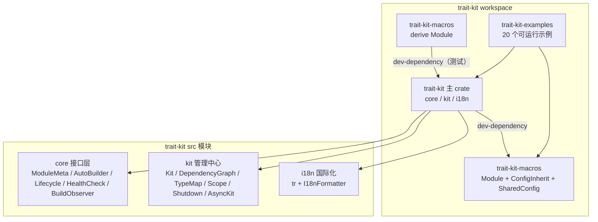
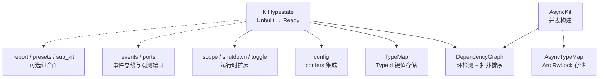
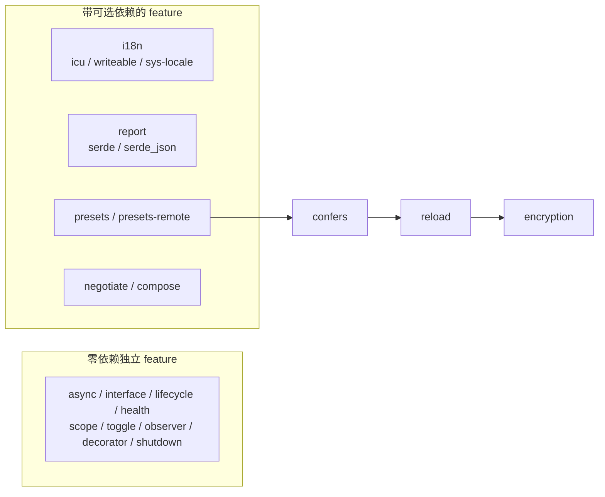
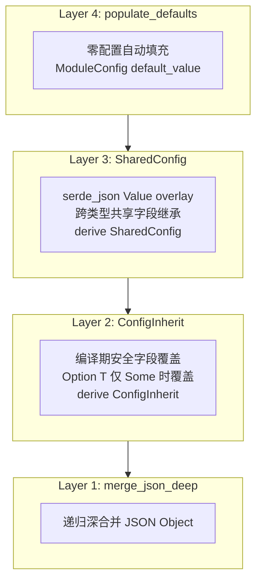
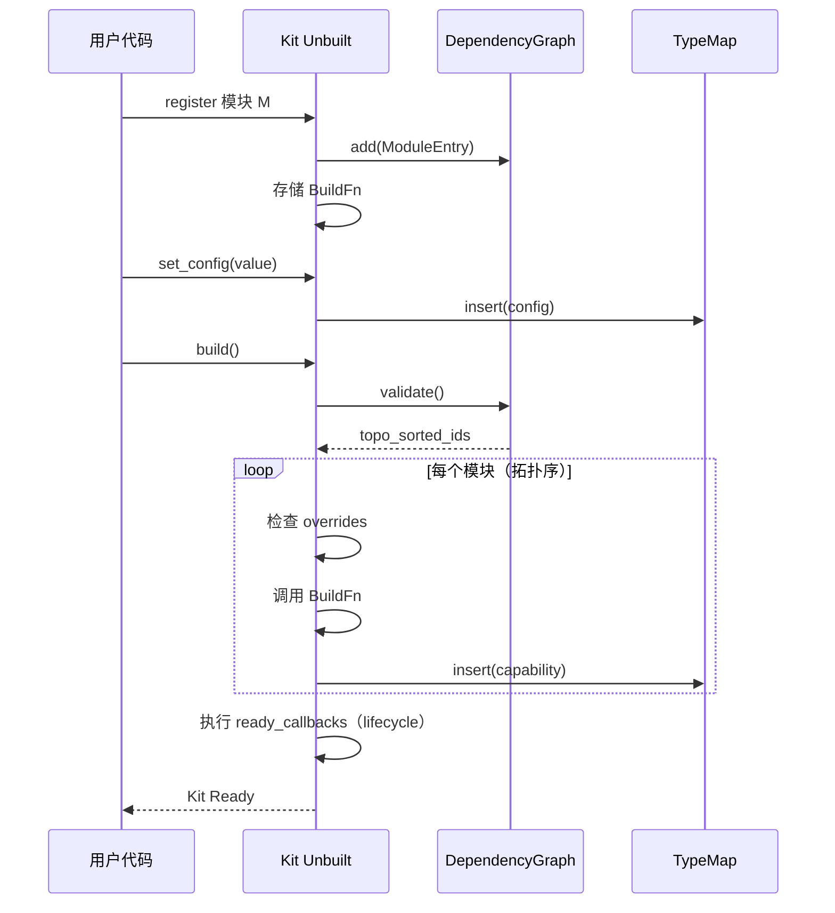
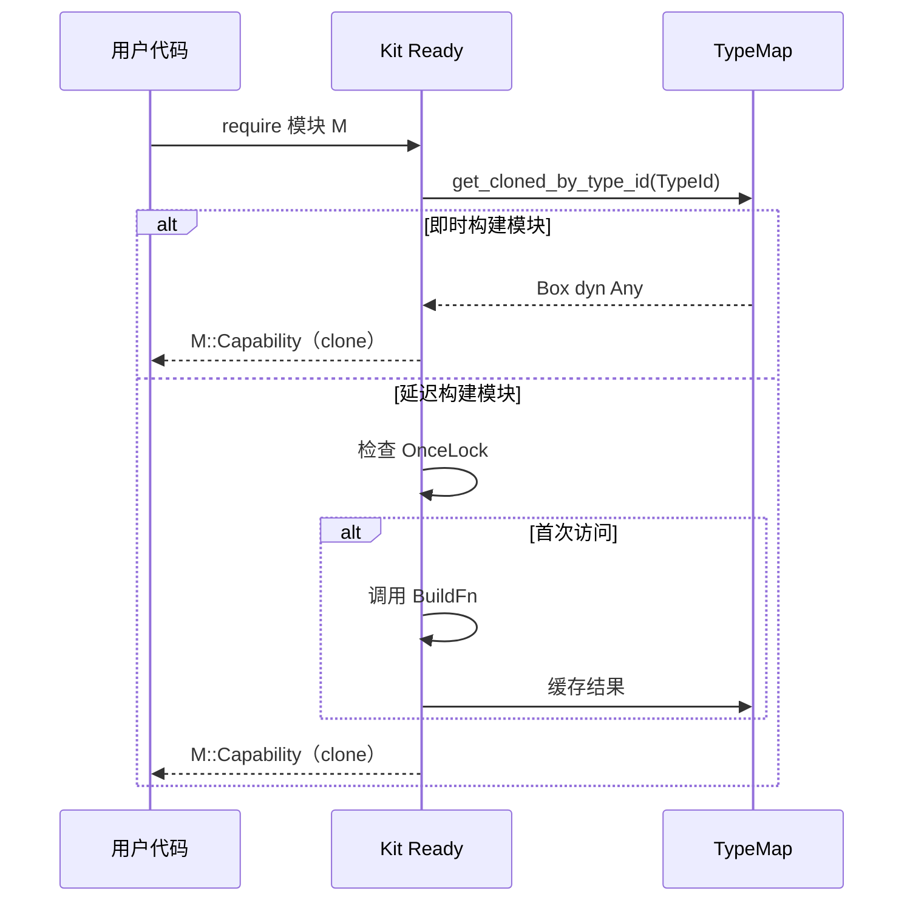

# 🏗️ Trait-Kit 架构文档

trait-kit 的架构设计围绕一个核心目标：**在应用启动时，以类型安全、可验证的方式装配模块依赖**。

## 📋 目录

<details open>
<summary>📑 目录</summary>

- [🗺️ 整体架构](#️-整体架构)
- [🧩 核心设计模式](#-核心设计模式)
- [📦 模块系统](#-模块系统)
- [🔄 数据流](#-数据流)
- [📁 目录结构](#-目录结构)
- [🧵 线程安全模型](#-线程安全模型)
- [🚪 错误处理](#-错误处理)

</details>

---

## 🗺️ 整体架构

trait-kit workspace 由四个成员组成。主 crate 的 `src/` 分三层：`core` 接口层、`kit` 能力管理中心、`i18n` 国际化。



`kit` 管理中心内部的组件关系：



## 🧩 核心设计模式

### Typestate 模式

Kit 使用 typestate 模式确保构建时验证：

```text
Kit<Unbuilt>                    Kit<Ready>
┌─────────────────┐   build()   ┌─────────────────┐
│ register()      │ ──────────→ │ require()       │
│ register_lazy() │             │ require_ref()   │
│ register_multi()│             │ optional()      │
│ register_as()   │             │ require_all()   │
│ set_config()    │             │ resolve()       │
│ build()         │             │ contains()      │
│ shutdown()      │             │ health_check()  │
└─────────────────┘             │ shutdown()      │
                                └─────────────────┘
```

- `Kit<Unbuilt>`：注册模块、配置、生命周期钩子。
- `kit.build()`：验证依赖图 → 拓扑排序 → 按序构建 → 返回 `Kit<Ready>`。
- `Kit<Ready>`：只读检索能力，不可再注册。

### 内部可变性

- **同步 Kit**：基于 `RefCell`，单线程 `!Sync` 设计，避免锁开销。
- **AsyncKit**：基于 `Arc<RwLock>`，多线程 `Send + Sync` 设计。

### 依赖图验证

`DependencyGraph` 在 `build()` 时执行两阶段验证：

1. **缺失依赖检测**：确保所有声明的依赖已注册。
2. **环检测 + 拓扑排序**：使用 Kahn 算法，发现环则返回错误。

构建按拓扑序执行，确保依赖先于消费者构建。

## 📦 模块系统

### 能力注册模式

| 模式 | 方法 | 说明 |
|---|---|---|
| 即时构建 | `register::<M>()` | `build()` 时按拓扑序构建 |
| 延迟构建 | `register_lazy::<M>()` | 首次 `require()` 时触发构建并缓存 |
| 多绑定 | `register_multi::<M>()` | 同类型聚合为 Vec，`require_all()` 检索 |
| 接口分离 | `register_as::<M>()` | `dyn Trait` 类型擦除注册 |
| 条件注册 | `register_if::<M>(pred)` | 运行时谓词控制 |
| 覆盖注入 | `override_module::<M>(cap)` | 测试注入，跳过 build_fn |

### Feature 分层

18 个可选 feature 中，confers 系列存在继承链，其余为零依赖独立 feature：



### 配置继承四层体系

`confers` feature 提供四层配置继承机制，支持跨模块/跨项目的配置丝滑继承：



**数据流**：`TraitKitConfig` → `extract_shared` → `shared_fields overlay` → `inject_shared` → `DbConfig`

## 🔄 数据流

### 构建流程



### 能力检索流程



## 📁 目录结构

```text
src/
├── lib.rs              # crate 入口，re-export
├── error.rs            # TraitKitError 错误类型（i18n 本地化）
├── prelude.rs          # 常用类型再导出
├── core/
│   ├── mod.rs          # 模块声明 + re-export
│   ├── meta.rs         # ModuleMeta / AutoBuilder / AsyncAutoBuilder / InterfaceBuilder
│   ├── macros.rs       # impl_module_meta! / impl_auto_builder! / impl_async_auto_builder!
│   ├── health.rs       # HealthCheck / AsyncHealthCheck / HealthStatus
│   ├── lifecycle.rs    # Lifecycle / AsyncLifecycle
│   └── observer.rs     # BuildObserver
├── kit/
│   ├── mod.rs          # Kit 模块声明 + re-export
│   ├── kit.rs          # Kit<Unbuilt> → Kit<Ready> typestate 实现
│   ├── kit_tests.rs    # kit.rs 内联测试的独立承载文件
│   ├── graph.rs        # DependencyGraph：环检测 + 拓扑排序
│   ├── typemap.rs      # TypeMap：TypeId 键值存储
│   ├── scope.rs        # Scope / AsyncScope
│   ├── shutdown.rs     # ShutdownCoordinator / AsyncShutdownCoordinator
│   ├── toggle.rs       # ToggleBackend / MemoryToggle / 类型化开关句柄
│   ├── async_kit.rs    # AsyncKit（并发构建 + Send + Sync）
│   ├── async_typemap.rs # AsyncTypeMap
│   ├── config.rs       # confers 集成（含加密存储 / KeyProvider）
│   ├── events.rs       # EventBus / KitEvent / MemoryEventBus
│   ├── ports.rs        # MetricsPort / LogPort 观测端口
│   ├── report.rs       # BuildReport 结构化构建报告
│   ├── presets.rs      # ConfersConfigModule 预设模块包
│   └── sub_kit.rs      # 子 Kit 组合（compose feature）
└── i18n/
    ├── mod.rs          # I18nManager + I18nFormatter + tr()
    ├── i18n_impl.rs    # 实现细节
    └── messages/
        ├── mod.rs      # FTL 嵌入
        ├── en.ftl      # 英文消息
        └── zh.ftl      # 中文消息
```

## 🧵 线程安全模型

| 类型 | Send | Sync | 说明 |
|---|---|---|---|
| `Kit<S>` | ✗ | ✗ | `RefCell` 内部可变性 |
| `AsyncKit<S>` | ✓ | ✓ | `Arc<RwLock>` |
| `Scope` | ✗ | ✗ | `RefCell` |
| `AsyncScope` | ✓ | ✓ | `Arc<RwLock>` |
| `TypeMap` | ✗ | ✗ | `RefCell<HashMap>` |
| `AsyncTypeMap` | ✓ | ✓ | `Arc<RwLock<HashMap>>` |
| `BuildObserver` | ✓ | ✓ | trait bound: `Send + Sync` |
| `ShutdownCoordinator` | ✗ | ✗ | `RefCell` |
| `AsyncShutdownCoordinator` | ✓ | ✓ | `Arc<RwLock>` |

## 🚪 错误处理

`TraitKitError` 统一所有 Kit 操作错误，`Display` 通过 `tr()` 自动本地化。全部变体的触发场景与处理建议见 [用户指南 · 故障排查](USER_GUIDE.md#-故障排查)，枚举定义与字段见 [API 参考 · 错误类型](API_REFERENCE.md#-错误类型)。
